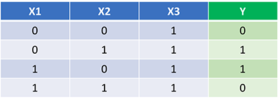
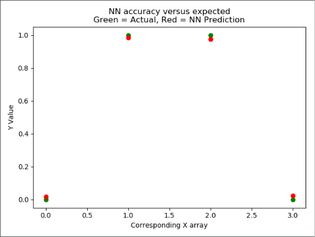

# An exploration in Neural Networks

Here is an attempt at creating a neural network from scratch following this tutorial by **James Loy**:

https://towardsdatascience.com/how-to-build-your-own-neural-network-from-scratch-in-python-68998a08e4f6

### Functions used as example data:

### MatPlotLib graph depicting the Y values of both the actual Y values and the prediction generated from the neural network.

This small example was made using the _NumPy_ and _MatPlotLib_ libraries. Most of this code can be found in the article created by **James Loy** linked above. __I do not intend to pass this off as my own code__, but rather as an _exploratory exercise_ that will lead to further endeavors within the realm of neural networks and machine learning.
